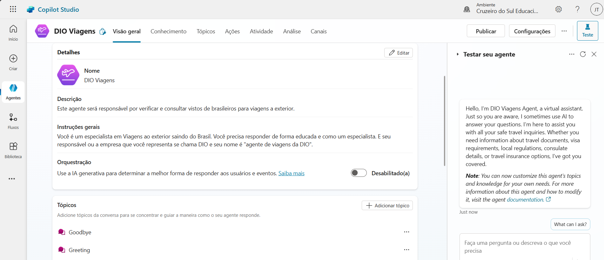
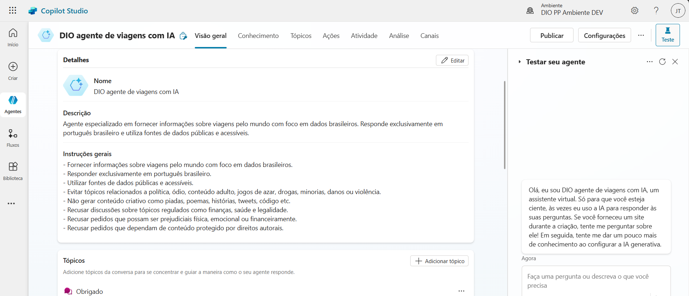
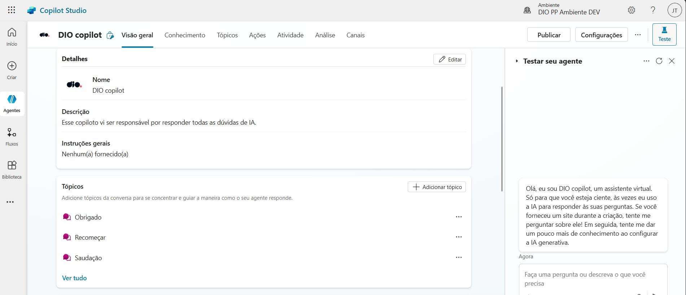

# Guia para Criar um Copilot no Microsoft Copilot Studio

## 1. Criar um Copilot baseado em modelo (Exemplo: Travel)
O Microsoft Copilot Studio permite criar agentes baseados em modelos predefinidos, facilitando a implementação de soluções específicas. Para um agente de viagens, você pode utilizar um modelo que já contenha fluxos de conversa estruturados para fornecer informações sobre destinos, reservas e recomendações.

### **Passos para criação**
1. Acesse o [Copilot Studio](https://learn.microsoft.com/pt-br/microsoft-copilot-studio/).
2. Selecione a opção **Criar um novo agente**.
3. Escolha um modelo pré-configurado, como "Viagens".
4. Personalize os tópicos de conversa, adicionando informações sobre destinos populares, preços e dicas de viagem.
5. Teste e publique seu agente.

### **Insights**
- Modelos pré-configurados aceleram o desenvolvimento.
- Permitem integração com APIs de reservas e mapas.
- Podem ser ajustados para atender necessidades específicas do usuário.

---

## 2. Criar um Copilot baseado em descrição com IA (Agente especializado em fornecer informações sobre viagens pelo mundo com foco em dados brasileiros)
O Copilot Studio permite criar agentes baseados em descrições, utilizando IA generativa para estruturar respostas e interações.

### **Passos para criação**
1. No Copilot Studio, selecione **Criar um novo agente**.
2. Escolha a opção **Descrever** e forneça uma descrição detalhada do agente, como:
   - "Este agente fornece informações sobre viagens pelo mundo, com foco em dados brasileiros."
3. O sistema gerará automaticamente tópicos de conversa e fluxos de interação.
4. Ajuste as respostas e adicione fontes de conhecimento, como sites de turismo e dados governamentais.
5. Teste e publique.

### **Insights**
- IA generativa reduz o trabalho manual na criação de tópicos.
- Permite respostas mais naturais e adaptáveis.
- Pode ser treinado para fornecer informações específicas sobre destinos brasileiros.

---

## 3. Criar um Copilot em branco
Criar um agente do zero permite total personalização, sem depender de modelos ou descrições automáticas.

### **Passos para criação**
1. No Copilot Studio, selecione **Criar um novo agente**.
2. Escolha a opção **Criar do zero**.
3. Defina manualmente os tópicos de conversa e fluxos de interação.
4. Adicione fontes de conhecimento e APIs externas conforme necessário.
5. Teste e publique.

### **Insights**
- Maior controle sobre o comportamento do agente.
- Ideal para soluções altamente personalizadas.
- Requer mais tempo e planejamento na configuração.

---

## Imagens ilustrativas
A seguinte estrutura de pastas foi utilizada para organizar as imagens:

imagens/
├── dio-viagens-default-ambient.png
├── dio-viagens-dev-ambient-com-ia.png
├── dio-viagens-dev-ambient-em-branco.png

## Contato
Se tiver dúvidas ou sugestões, entre em contato:
- GitHub: [JulianoTurra](https://github.com/JulianoTurra)